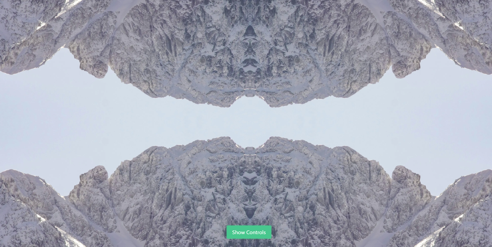

## A web app that produces a "seamless" tile version of the input image by performing basic mirror transformations.

[Click here](http://seamlessly.vincemaina.co.uk) to try it out

# How it works

This is a simple application that uses FFMPEG to stitch together mirrored variations of the input image to produce a "seamless" output image. The quality of the output image largely depends on the input image you use.

The main use cases I see for this are:

1. Creating a seamless textured background, particularly animated textures, like grain overlays.
1. Creating interesting patterns and kaleidoscope-like effects from both real-world images and computer-generated graphics.

Output file types are designed to be compatible with the css style attribute "background-image".

# Examples (smoothen edges & create abstract effects)

**BEFORE using Seamlessly:**

**AFTER using Seamlessly:**

**BEFORE:**

**AFTER:**

**BEFORE:**

In this example we can see the bricks aren't quite lining up.

**AFTER:**

**BEFORE:**

Here we use an image of a mountain range to create an abstract effect.

**AFTER:**

# How to get the best results

For this to work well, you need to use an input file that already has a fairly "uniform" texture. E.g. grain, scratches, crinkled paper etc. Any distincitive features in the image will stand out as they'll be mirrored and repeated across the page (whether or not that's a bad thing depends on the use case!)

# Feature requests

This was just a mini project, so won't be putting anymore time into it unless it generates some interest.

So if *have* stumbled across this app, and would like to see more features added (e.g. more accepted file types) please follow the project, and consider creating an issue [here](https://github.com/vchapandrews/seamlessly/issues) with your feature request.